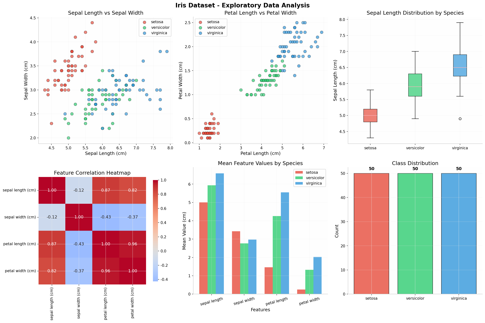
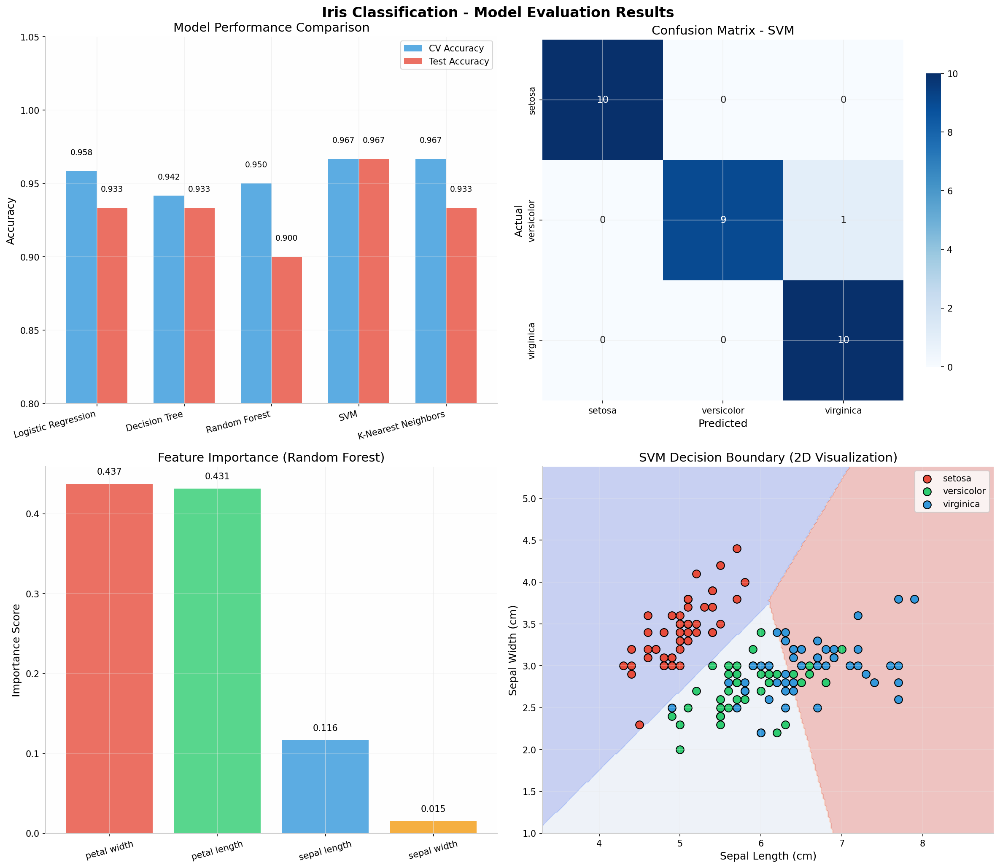

# 🌸 Iris Flower Classification - CodeAlpha Internship

**Task 1** | CodeAlpha Data Science Internship | May 2026


*Iris setosa, versicolor, and virginica - the three species classified in this project*

---

## 📋 Project Overview

This project implements a machine learning pipeline to classify iris flowers into three species (**setosa**, **versicolor**, **virginica**) based on their morphological measurements using Python and Scikit-learn.

## 🎯 Objectives

- Perform Exploratory Data Analysis (EDA) on the Iris dataset
- Compare multiple ML algorithms (Logistic Regression, Decision Tree, Random Forest, SVM, KNN)
- Apply hyperparameter tuning for optimal performance
- Evaluate model using cross-validation and confusion matrix
- Deploy a prediction function for real-time classification

## 🛠️ Tools & Technologies

| Category | Tools |
|----------|-------|
| **Language** | Python 3.x |
| **Libraries** | Pandas, NumPy, Matplotlib, Seaborn, Scikit-learn |
| **ML Models** | Logistic Regression, Decision Tree, Random Forest, SVM, KNN |
| **Evaluation** | Cross-validation, Grid Search, Confusion Matrix |

## 📊 Dataset

- **Source**: Scikit-learn built-in Iris dataset
- **Samples**: 150 flowers (50 per species)
- **Features**: 4 measurements (in cm)
  - Sepal Length
  - Sepal Width  
  - Petal Length
  - Petal Width
- **Target**: 3 species (setosa, versicolor, virginica)


*Feature anatomy: Sepal and Petal measurements*

## 🔬 Methodology

### 1. Data Preprocessing
- Train-test split (80-20)
- Feature standardization using StandardScaler

### 2. Model Comparison
| Model | CV Accuracy | Test Accuracy |
|-------|-------------|---------------|
| SVM | 96.67% | **96.67%** ✅ |
| KNN | 96.67% | 93.33% |
| Logistic Regression | 95.83% | 93.33% |
| Decision Tree | 94.17% | 93.33% |
| Random Forest | 95.00% | 90.00% |

### 3. Hyperparameter Tuning
- **Best Parameters**: `C=0.1`, `kernel='linear'`, `gamma='scale'`
- **Best CV Score**: 97.50%

### 4. Key Findings
- **Petal Width** (43.7%) and **Petal Length** (43.1%) are the most important features
- **Setosa** is perfectly separable from other species
- Only 1 misclassification between versicolor and virginica

## 📈 Results

- **Final Accuracy**: **96.67%**
- **Precision**: 97% (macro average)
- **Recall**: 97% (macro average)
- **F1-Score**: 97% (macro average)

## 📊 Visualizations

### Exploratory Data Analysis


*Comprehensive EDA: Scatter plots, box plots, correlation heatmap, and feature distributions*

### Model Evaluation


*Model comparison, confusion matrix, feature importance, and SVM decision boundary*

## 🚀 How to Run

```bash
# Clone the repository
git clone https://github.com/yourusername/CodeAlpha_IrisClassification.git
cd CodeAlpha_IrisClassification

# Install dependencies
pip install pandas numpy matplotlib seaborn scikit-learn

# Run the script
python iris_classification.py
```

## 📁 Files

| File | Description |
|------|-------------|
| `iris_classification.py` | Complete Python script |
| `iris_eda_analysis.png` | EDA visualizations |
| `iris_model_evaluation.png` | Model comparison & evaluation charts |
| `README.md` | Project documentation |

## 🎓 Learning Outcomes

- Data preprocessing and feature scaling
- Multiple ML algorithm implementation and comparison
- Cross-validation and hyperparameter tuning
- Model evaluation metrics interpretation
- Real-world classification problem solving

## 📧 Contact

- **Internship**: CodeAlpha (www.codealpha.tech)
- **LinkedIn**: [linkedin.com/in/dinesh-tanwar-426a333a9]

---

*This project was completed as part of the CodeAlpha Data Science Internship Program.*
